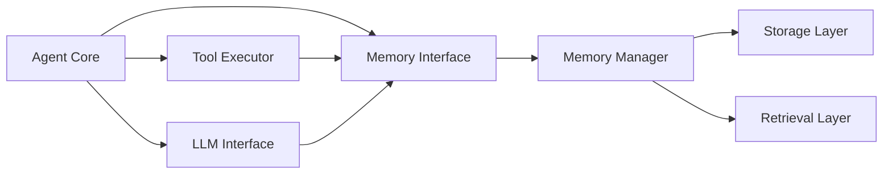

# Memory Architecture for Agent Systems

## Overview
This document defines a comprehensive memory architecture for AI agent systems, detailing components, storage layers, retrieval mechanisms, update strategies, and integration points.

---

## 1. Architecture Components

### 1.1 Storage Layer
**Purpose**: Persistent and temporary data storage

**Components**:
- **In-Memory Store**: RAM-based cache for active data
- **Vector Database**: Embeddings for similarity search (Pinecone, Weaviate, ChromaDB)
- **Relational Database**: Structured data (PostgreSQL, MySQL)
- **Document Store**: JSON/NoSQL data (MongoDB, DynamoDB)
- **File System**: Large objects and backups

**Responsibilities**:
- Data persistence
- CRUD operations
- Data integrity
- Backup and recovery

---

### 1.2 Retrieval Layer
**Purpose**: Efficient memory access and search

**Components**:
- **Query Engine**: Processes retrieval requests
- **Search Index**: Fast lookup structures
- **Cache Manager**: Hot data caching
- **Ranking System**: Result prioritization

**Responsibilities**:
- Query parsing
- Index management
- Result ranking
- Cache optimization

---

### 1.3 Encoding Layer
**Purpose**: Transform data into storable formats

**Components**:
- **Embedding Generator**: Text-to-vector conversion
- **Serializer**: Object encoding/decoding
- **Compressor**: Data compression
- **Encryptor**: Security layer

**Responsibilities**:
- Data transformation
- Format conversion
- Compression
- Encryption/decryption

---

### 1.4 Management Layer
**Purpose**: Memory lifecycle and optimization

**Components**:
- **Memory Manager**: Allocation and deallocation
- **Eviction Policy**: Remove stale data
- **Consolidation Engine**: Merge and summarize
- **Monitoring System**: Performance tracking

**Responsibilities**:
- Memory allocation
- Garbage collection
- Performance optimization
- Resource monitoring

---

### 1.5 Integration Layer
**Purpose**: Connect memory system with agent components

**Components**:
- **API Gateway**: External access interface
- **Event Bus**: Asynchronous communication
- **Adapter Layer**: System integrations
- **Middleware**: Request/response processing

**Responsibilities**:
- API management
- Event handling
- System integration
- Protocol translation

---

## 2. Storage Hierarchy

### 2.1 Working Memory
**Characteristics**:
- **Capacity**: 3-7 items
- **Duration**: Task-scoped
- **Storage**: RAM
- **Access Time**: <1ms

**Implementation**:
```python
class WorkingMemory:
    def __init__(self, capacity=7):
        self.capacity = capacity
        self.buffer = {}
        self.access_order = []
    
    def store(self, key, value):
        if len(self.buffer) >= self.capacity:
            oldest = self.access_order.pop(0)
            del self.buffer[oldest]
        self.buffer[key] = value
        self.access_order.append(key)
    
    def retrieve(self, key):
        return self.buffer.get(key)
    
    def clear(self):
        self.buffer.clear()
        self.access_order.clear()
```

**Use Cases**:
- Intermediate computation results
- Active task state
- Tool call outputs

---

### 2.2 Short-Term Storage
**Characteristics**:
- **Capacity**: 100-1000 items
- **Duration**: Session-based
- **Storage**: RAM + Redis
- **Access Time**: 1-10ms

**Implementation**:
```python
class ShortTermMemory:
    def __init__(self, redis_client, ttl=3600):
        self.cache = {}
        self.redis = redis_client
        self.ttl = ttl
    
    def store(self, key, value):
        self.cache[key] = value
        self.redis.setex(key, self.ttl, json.dumps(value))
    
    def retrieve(self, key):
        if key in self.cache:
            return self.cache[key]
        data = self.redis.get(key)
        if data:
            self.cache[key] = json.loads(data)
            return self.cache[key]
        return None
```

**Use Cases**:
- Conversation context
- Session state
- Recent interactions

---

### 2.3 Long-Term Storage
**Characteristics**:
- **Capacity**: Unlimited (storage-bound)
- **Duration**: Persistent
- **Storage**: Database + Vector Store
- **Access Time**: 10-100ms

**Implementation**:
```python
class LongTermMemory:
    def __init__(self, db, vector_store):
        self.db = db
        self.vector_store = vector_store
    
    def store(self, memory_id, content, metadata):
        # Store structured data
        self.db.insert({
            'id': memory_id,
            'content': content,
            'metadata': metadata,
            'timestamp': datetime.now()
        })
        
        # Store embedding
        embedding = self.generate_embedding(content)
        self.vector_store.upsert(memory_id, embedding, metadata)
    
    def retrieve(self, query, limit=10):
        embedding = self.generate_embedding(query)
        results = self.vector_store.search(embedding, limit)
        return [self.db.get(r['id']) for r in results]
```

**Use Cases**:
- User profiles
- Historical interactions
- Knowledge base

---

## 3. Retrieval Mechanisms

### 3.1 Exact Match
**Method**: Direct key-value lookup

**Algorithm**:
```python
class ExactMatchRetrieval:
    def __init__(self, storage):
        self.storage = storage
        self.index = {}
    
    def index_memory(self, key, memory_id):
        self.index[key] = memory_id
    
    def retrieve(self, key):
        memory_id = self.index.get(key)
        if memory_id:
            return self.storage.get(memory_id)
        return None
```

**Use Cases**:
- User ID lookup
- Session retrieval
- Fact checking

**Performance**: O(1) - Constant time

---

### 3.2 Similarity Search
**Method**: Vector-based semantic search

**Algorithm**:
```python
class SimilarityRetrieval:
    def __init__(self, vector_store, embedding_model):
        self.vector_store = vector_store
        self.embedding_model = embedding_model
    
    def retrieve(self, query, top_k=5, threshold=0.7):
        query_embedding = self.embedding_model.encode(query)
        results = self.vector_store.search(
            query_embedding, 
            top_k=top_k
        )
        return [r for r in results if r['score'] >= threshold]
```

**Use Cases**:
- Semantic search
- Related memory retrieval
- Context finding

**Performance**: O(log n) with HNSW index

---

### 3.3 Query-Based
**Method**: Structured query language

**Algorithm**:
```python
class QueryBasedRetrieval:
    def __init__(self, database):
        self.db = database
    
    def retrieve(self, filters, sort_by=None, limit=10):
        query = self.build_query(filters)
        if sort_by:
            query = query.order_by(sort_by)
        return query.limit(limit).execute()
    
    def build_query(self, filters):
        query = self.db.table('memories')
        for field, value in filters.items():
            query = query.where(field, '==', value)
        return query
```

**Use Cases**:
- Filtered search
- Time-range queries
- Metadata filtering

**Performance**: O(log n) with indexes

---

### 3.4 Hybrid Retrieval
**Method**: Combine multiple retrieval strategies

**Algorithm**:
```python
class HybridRetrieval:
    def __init__(self, exact_match, similarity, query_based):
        self.exact = exact_match
        self.similarity = similarity
        self.query = query_based
    
    def retrieve(self, query_obj, strategy='auto'):
        results = []
        
        # Try exact match first
        if query_obj.get('exact_key'):
            exact_result = self.exact.retrieve(query_obj['exact_key'])
            if exact_result:
                return [exact_result]
        
        # Similarity search
        if query_obj.get('semantic_query'):
            sim_results = self.similarity.retrieve(
                query_obj['semantic_query'], 
                top_k=5
            )
            results.extend(sim_results)
        
        # Query-based filtering
        if query_obj.get('filters'):
            query_results = self.query.retrieve(
                query_obj['filters'], 
                limit=5
            )
            results.extend(query_results)
        
        # Deduplicate and rank
        return self.rank_and_deduplicate(results)
    
    def rank_and_deduplicate(self, results):
        seen = set()
        ranked = []
        for r in sorted(results, key=lambda x: x.get('score', 0), reverse=True):
            if r['id'] not in seen:
                seen.add(r['id'])
                ranked.append(r)
        return ranked
```

**Use Cases**:
- Complex queries
- Multi-criteria search
- Fallback strategies

**Performance**: Varies by strategy mix

---

## 4. Update Strategies

### 4.1 Append-Only
**Description**: New memories are always added, never modified

```python
class AppendOnlyStrategy:
    def update(self, storage, memory):
        memory['id'] = generate_uuid()
        memory['timestamp'] = datetime.now()
        storage.insert(memory)
        return memory['id']
```

**Pros**: Simple, audit trail, no conflicts
**Cons**: Storage growth, duplicate data

---

### 4.2 Upsert
**Description**: Update if exists, insert if new

```python
class UpsertStrategy:
    def update(self, storage, memory_id, memory):
        existing = storage.get(memory_id)
        if existing:
            memory['updated_at'] = datetime.now()
            storage.update(memory_id, memory)
        else:
            memory['created_at'] = datetime.now()
            storage.insert(memory_id, memory)
```

**Pros**: No duplicates, current data
**Cons**: Lost history, version conflicts

---

### 4.3 Versioned
**Description**: Keep multiple versions with timestamps

```python
class VersionedStrategy:
    def update(self, storage, memory_id, memory):
        version = {
            'memory_id': memory_id,
            'version': self.get_next_version(memory_id),
            'data': memory,
            'timestamp': datetime.now()
        }
        storage.insert_version(version)
    
    def get_latest(self, storage, memory_id):
        return storage.query(memory_id).order_by('version', 'desc').first()
```

**Pros**: Full history, rollback capability
**Cons**: Storage overhead, complexity

---

### 4.4 Consolidation
**Description**: Merge and summarize related memories

```python
class ConsolidationStrategy:
    def consolidate(self, storage, memory_ids):
        memories = [storage.get(mid) for mid in memory_ids]
        consolidated = self.merge_memories(memories)
        
        # Store consolidated version
        new_id = storage.insert(consolidated)
        
        # Archive originals
        for mid in memory_ids:
            storage.archive(mid)
        
        return new_id
    
    def merge_memories(self, memories):
        return {
            'content': self.summarize([m['content'] for m in memories]),
            'metadata': self.merge_metadata(memories),
            'source_ids': [m['id'] for m in memories],
            'consolidated_at': datetime.now()
        }
```

**Pros**: Reduced storage, improved relevance
**Cons**: Information loss, processing cost

---

## 5. Integration Points

### 5.1 Agent Core Integration



**Integration Pattern**:
```python
class AgentWithMemory:
    def __init__(self, memory_system):
        self.memory = memory_system
        self.working_memory = WorkingMemory()
    
    def process_request(self, user_input):
        # Retrieve relevant context
        context = self.memory.retrieve_context(user_input)
        
        # Store in working memory
        self.working_memory.store('context', context)
        self.working_memory.store('input', user_input)
        
        # Process with LLM
        response = self.llm.generate(user_input, context)
        
        # Store interaction
        self.memory.store_interaction(user_input, response)
        
        # Clear working memory
        self.working_memory.clear()
        
        return response
```

---

### 5.2 Tool Integration

```python
class MemoryTool:
    def __init__(self, memory_system):
        self.memory = memory_system
    
    def store_fact(self, key, value, metadata=None):
        return self.memory.semantic.store(key, value, metadata)
    
    def recall_fact(self, key):
        return self.memory.semantic.retrieve(key)
    
    def search_memories(self, query, filters=None):
        return self.memory.hybrid_retrieve(query, filters)
    
    def get_conversation_history(self, limit=10):
        return self.memory.episodic.get_recent(limit)
```

---

### 5.3 Event-Driven Integration

```python
class MemoryEventHandler:
    def __init__(self, memory_system, event_bus):
        self.memory = memory_system
        self.event_bus = event_bus
        self.subscribe_to_events()
    
    def subscribe_to_events(self):
        self.event_bus.on('user_message', self.on_user_message)
        self.event_bus.on('agent_response', self.on_agent_response)
        self.event_bus.on('task_completed', self.on_task_completed)
    
    def on_user_message(self, event):
        self.memory.episodic.store({
            'type': 'user_message',
            'content': event['message'],
            'timestamp': event['timestamp']
        })
    
    def on_agent_response(self, event):
        self.memory.episodic.store({
            'type': 'agent_response',
            'content': event['response'],
            'timestamp': event['timestamp']
        })
    
    def on_task_completed(self, event):
        # Consolidate working memory to long-term
        self.memory.consolidate_task(event['task_id'])
```

---

### 5.4 API Integration

```python
class MemoryAPI:
    def __init__(self, memory_system):
        self.memory = memory_system
    
    # REST endpoints
    def store_memory(self, request):
        """POST /memories"""
        memory_id = self.memory.store(
            content=request.json['content'],
            metadata=request.json.get('metadata', {})
        )
        return {'id': memory_id}, 201
    
    def retrieve_memory(self, memory_id):
        """GET /memories/{id}"""
        memory = self.memory.retrieve(memory_id)
        return memory if memory else ({}, 404)
    
    def search_memories(self, request):
        """POST /memories/search"""
        results = self.memory.search(
            query=request.json['query'],
            filters=request.json.get('filters'),
            limit=request.json.get('limit', 10)
        )
        return {'results': results}
```

---

## 6. Architecture Patterns

### 6.1 Layered Architecture

```
┌─────────────────────────────────────┐
│      Application Layer              │
│  (Agent Core, Tools, LLM)           │
└─────────────────────────────────────┘
              ↓
┌─────────────────────────────────────┐
│      Memory Interface Layer         │
│  (API, Adapters, Middleware)        │
└─────────────────────────────────────┘
              ↓
┌─────────────────────────────────────┐
│      Business Logic Layer           │
│  (Memory Manager, Retrieval Engine) │
└─────────────────────────────────────┘
              ↓
┌─────────────────────────────────────┐
│      Data Access Layer              │
│  (Storage, Cache, Index)            │
└─────────────────────────────────────┘
              ↓
┌─────────────────────────────────────┐
│      Infrastructure Layer           │
│  (Database, Vector Store, Redis)    │
└─────────────────────────────────────┘
```

**Benefits**: Separation of concerns, testability, maintainability

---

### 6.2 Microservices Architecture

```
┌──────────────┐    ┌──────────────┐    ┌──────────────┐
│   Storage    │    │  Retrieval   │    │   Encoding   │
│   Service    │    │   Service    │    │   Service    │
└──────────────┘    └──────────────┘    └──────────────┘
       ↓                   ↓                    ↓
┌────────────────────────────────────────────────────────┐
│              Message Bus / API Gateway                 │
└────────────────────────────────────────────────────────┘
       ↑                   ↑                    ↑
┌──────────────┐    ┌──────────────┐    ┌──────────────┐
│  Management  │    │ Integration  │    │   Monitor    │
│   Service    │    │   Service    │    │   Service    │
└──────────────┘    └──────────────┘    └──────────────┘
```

**Benefits**: Scalability, independent deployment, fault isolation

---

### 6.3 Event-Driven Architecture

```
┌─────────────┐         ┌─────────────┐
│   Agent     │────────>│ Event Bus   │
└─────────────┘         └─────────────┘
                              │
                ┌─────────────┼─────────────┐
                ↓             ↓             ↓
        ┌──────────────┐ ┌──────────┐ ┌──────────┐
        │Memory Storage│ │Retrieval │ │Analytics │
        │   Handler    │ │ Handler  │ │ Handler  │
        └──────────────┘ └──────────┘ └──────────┘
```

**Benefits**: Loose coupling, asynchronous processing, scalability

---

### 6.4 Hybrid Architecture (Recommended)

```
┌─────────────────────────────────────────────────────┐
│                   Agent Layer                       │
└─────────────────────────────────────────────────────┘
                        ↓
┌─────────────────────────────────────────────────────┐
│              Memory Interface (API)                 │
└─────────────────────────────────────────────────────┘
                        ↓
        ┌───────────────┴───────────────┐
        ↓                               ↓
┌──────────────────┐          ┌──────────────────┐
│  Synchronous     │          │  Asynchronous    │
│  Operations      │          │  Operations      │
│  (Read/Write)    │          │  (Events)        │
└──────────────────┘          └──────────────────┘
        ↓                               ↓
┌──────────────────┐          ┌──────────────────┐
│  Cache Layer     │          │  Event Bus       │
│  (Redis)         │          │  (Kafka/RabbitMQ)│
└──────────────────┘          └──────────────────┘
        ↓                               ↓
┌─────────────────────────────────────────────────────┐
│              Storage Layer                          │
│  (PostgreSQL, Vector DB, Document Store)            │
└─────────────────────────────────────────────────────┘
```

**Benefits**: Combines strengths of multiple patterns, flexible, production-ready

---

## 7. Design Decisions

### 7.1 Storage Technology Selection

**Decision**: Use hybrid storage approach
- **Vector Database** (Pinecone/Weaviate) for semantic search
- **PostgreSQL** for structured data and transactions
- **Redis** for caching and session data

**Rationale**:
- Vector DB excels at similarity search
- PostgreSQL provides ACID guarantees
- Redis offers sub-millisecond latency
- Each optimized for specific use case

**Trade-offs**:
- Increased complexity vs. single database
- Multiple systems to maintain
- Data synchronization challenges
- Better performance and scalability

---

### 7.2 Retrieval Strategy

**Decision**: Implement hybrid retrieval with fallback

**Rationale**:
- No single method works for all queries
- Exact match fastest when applicable
- Similarity search for semantic queries
- Query-based for complex filters

**Implementation Priority**:
1. Exact match (if key provided)
2. Similarity search (for semantic queries)
3. Query-based (for filtered searches)
4. Combine and rank results

---

### 7.3 Memory Hierarchy

**Decision**: Three-tier hierarchy (Working, Short-Term, Long-Term)

**Rationale**:
- Working memory for active processing (minimal latency)
- Short-term for session context (fast access)
- Long-term for persistence (unlimited capacity)

**Eviction Policy**:
- Working: LRU with capacity limit
- Short-term: TTL-based (1 hour default)
- Long-term: No automatic eviction

---

### 7.4 Update Strategy

**Decision**: Versioned updates for critical data, upsert for others

**Rationale**:
- User profiles: Versioned (audit trail needed)
- Conversation history: Append-only (immutable events)
- Session state: Upsert (current state only)
- Consolidated summaries: Periodic consolidation

---

### 7.5 Consistency Model

**Decision**: Eventual consistency with strong consistency option

**Rationale**:
- Most agent operations tolerate slight delays
- Strong consistency for critical operations (user auth)
- Eventual consistency improves performance
- Configurable per operation

**Implementation**:
```python
class MemorySystem:
    def store(self, memory, consistency='eventual'):
        if consistency == 'strong':
            return self.sync_store(memory)
        else:
            return self.async_store(memory)
```

---

### 7.6 Scalability Approach

**Decision**: Horizontal scaling with sharding

**Rationale**:
- User-based sharding (partition by user_id)
- Independent scaling of components
- Load balancing across instances
- No single point of failure

**Sharding Strategy**:
```python
def get_shard(user_id, num_shards=16):
    return hash(user_id) % num_shards
```

---

## 8. Example Implementation

### Complete Memory System

```python
class MemorySystem:
    def __init__(self, config):
        # Initialize storage layers
        self.working = WorkingMemory(capacity=7)
        self.short_term = ShortTermMemory(
            redis_client=config.redis,
            ttl=3600
        )
        self.long_term = LongTermMemory(
            db=config.database,
            vector_store=config.vector_db
        )
        
        # Initialize retrieval mechanisms
        self.exact_match = ExactMatchRetrieval(self.long_term)
        self.similarity = SimilarityRetrieval(
            config.vector_db,
            config.embedding_model
        )
        self.query_based = QueryBasedRetrieval(config.database)
        self.hybrid = HybridRetrieval(
            self.exact_match,
            self.similarity,
            self.query_based
        )
        
        # Initialize management
        self.manager = MemoryManager(self)
        self.consolidator = ConsolidationStrategy()
    
    def store(self, content, memory_type='long_term', metadata=None):
        if memory_type == 'working':
            return self.working.store(content['key'], content['value'])
        elif memory_type == 'short_term':
            return self.short_term.store(content['key'], content['value'])
        else:
            return self.long_term.store(
                generate_uuid(),
                content,
                metadata or {}
            )
    
    def retrieve(self, query, strategy='hybrid'):
        if strategy == 'exact':
            return self.exact_match.retrieve(query)
        elif strategy == 'similarity':
            return self.similarity.retrieve(query)
        elif strategy == 'query':
            return self.query_based.retrieve(query)
        else:
            return self.hybrid.retrieve(query)
    
    def consolidate(self, memory_ids):
        return self.consolidator.consolidate(
            self.long_term,
            memory_ids
        )
```

### Usage Example

```python
# Initialize system
config = MemoryConfig(
    redis=redis.Redis(host='localhost'),
    database=PostgreSQL('memory_db'),
    vector_db=Pinecone('memory-index'),
    embedding_model=OpenAIEmbeddings()
)
memory = MemorySystem(config)

# Store memories
memory.store(
    {'key': 'current_task', 'value': 'code_review'},
    memory_type='working'
)

memory.store(
    {'key': 'session_123', 'value': {'user': 'john', 'context': [...]}},
    memory_type='short_term'
)

memory.store(
    'User prefers Python for backend development',
    memory_type='long_term',
    metadata={'user_id': 'john', 'type': 'preference'}
)

# Retrieve memories
results = memory.retrieve(
    {'semantic_query': 'What does the user prefer for backend?'},
    strategy='hybrid'
)

# Consolidate related memories
memory.consolidate(['mem_1', 'mem_2', 'mem_3'])
```

---

## 9. Performance Considerations

### Latency Targets
- Working Memory: <1ms
- Short-Term Memory: <10ms
- Long-Term Memory: <100ms
- Similarity Search: <200ms

### Optimization Strategies
1. **Caching**: Multi-level cache (L1: RAM, L2: Redis)
2. **Indexing**: B-tree for exact match, HNSW for vectors
3. **Batching**: Batch writes to reduce I/O
4. **Compression**: Compress old memories
5. **Sharding**: Distribute load across instances

---

## 10. Monitoring and Observability

### Key Metrics
- Memory usage per layer
- Retrieval latency (p50, p95, p99)
- Cache hit rate
- Storage growth rate
- Query throughput

### Logging Strategy
```python
class MemoryLogger:
    def log_operation(self, operation, duration, metadata):
        log.info({
            'operation': operation,
            'duration_ms': duration,
            'memory_type': metadata.get('type'),
            'success': metadata.get('success'),
            'timestamp': datetime.now()
        })
```

---

## Conclusion

This memory architecture provides a robust, scalable foundation for AI agent systems. The hybrid approach combines multiple storage technologies, retrieval mechanisms, and architectural patterns to deliver optimal performance across diverse use cases.

**Key Takeaways**:
- Three-tier memory hierarchy balances speed and persistence
- Hybrid retrieval supports diverse query patterns
- Modular design enables independent scaling
- Event-driven integration supports asynchronous operations
- Versioned updates maintain audit trails
- Monitoring ensures production reliability
